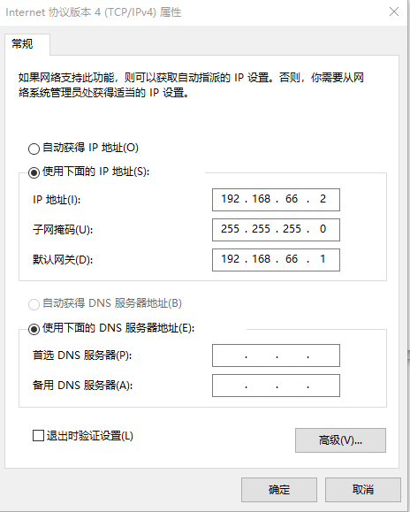

Centos虚拟机参数：

```
k8s-master
cpu:2
内存:4G
硬盘：100G
网络适配器：NAT
```

```
k8s-node
cpu:2
内存:4G
硬盘：100G
网络适配器：NAT
```

```
kube-edge
cpu:2
内存:2G
硬盘：100G
网络适配器：NAT
```

Centos虚拟机网络配置：

```
VMware配置
```


```
宿主机配置：
```



Centos虚拟机ens33配置：

```
cd /etc/sysconfig/network-scripts
vim ifcfg-ens33

k8s-master01:
TYPE=Ethernet
PROXY_METHOD=none
BROWSER_ONLY=no
BOOTPROTO=static
DEFROUTE=yes
IPV4_FAILURE_FATAL=no
IPV6INIT=yes
IPV6_AUTOCONF=yes
IPV6_DEFROUTE=yes
IPV6_FAILURE_FATAL=no
IPV6_ADDR_GEN_MODE=stable-privacy
NAME=ens33
UUID=41f7fd84-1147-493a-b64a-e4ad1cc31387
DEVICE=ens33
ONBOOT=yes
IPADDR=192.168.66.10
NETMASK=255.255.255.0
GATEWAY=192.168.66.1
DNS1=8.8.8.8

k8s-node01:
TYPE=Ethernet
PROXY_METHOD=none
BROWSER_ONLY=no
BOOTPROTO=static
DEFROUTE=yes
IPV4_FAILURE_FATAL=no
IPV6INIT=yes
IPV6_AUTOCONF=yes
IPV6_DEFROUTE=yes
IPV6_FAILURE_FATAL=no
IPV6_ADDR_GEN_MODE=stable-privacy
NAME=ens33
UUID=41f7fd84-1147-493a-b64a-e4ad1cc31387
DEVICE=ens33
ONBOOT=yes
IPADDR=192.168.66.20
NETMASK=255.255.255.0
GATEWAY=192.168.66.1
DNS1=8.8.8.8

k8s-node02:
TYPE=Ethernet
PROXY_METHOD=none
BROWSER_ONLY=no
BOOTPROTO=static
DEFROUTE=yes
IPV4_FAILURE_FATAL=no
IPV6INIT=yes
IPV6_AUTOCONF=yes
IPV6_DEFROUTE=yes
IPV6_FAILURE_FATAL=no
IPV6_ADDR_GEN_MODE=stable-privacy
NAME=ens33
UUID=41f7fd84-1147-493a-b64a-e4ad1cc31387
DEVICE=ens33
ONBOOT=yes
IPADDR=192.168.66.21
NETMASK=255.255.255.0
GATEWAY=192.168.66.1
DNS1=8.8.8.8

kube-edge01:
TYPE=Ethernet
PROXY_METHOD=none
BROWSER_ONLY=no
BOOTPROTO=static
DEFROUTE=yes
IPV4_FAILURE_FATAL=no
IPV6INIT=yes
IPV6_AUTOCONF=yes
IPV6_DEFROUTE=yes
IPV6_FAILURE_FATAL=no
IPV6_ADDR_GEN_MODE=stable-privacy
NAME=ens33
UUID=41f7fd84-1147-493a-b64a-e4ad1cc31387
DEVICE=ens33
ONBOOT=yes
IPADDR=192.168.66.30
NETMASK=255.255.255.0
GATEWAY=192.168.66.1
DNS1=8.8.8.8

kube-edge02:
TYPE=Ethernet
PROXY_METHOD=none
BROWSER_ONLY=no
BOOTPROTO=static
DEFROUTE=yes
IPV4_FAILURE_FATAL=no
IPV6INIT=yes
IPV6_AUTOCONF=yes
IPV6_DEFROUTE=yes
IPV6_FAILURE_FATAL=no
IPV6_ADDR_GEN_MODE=stable-privacy
NAME=ens33
UUID=41f7fd84-1147-493a-b64a-e4ad1cc31387
DEVICE=ens33
ONBOOT=yes
IPADDR=192.168.66.31
NETMASK=255.255.255.0
GATEWAY=192.168.66.1
DNS1=8.8.8.8
```

